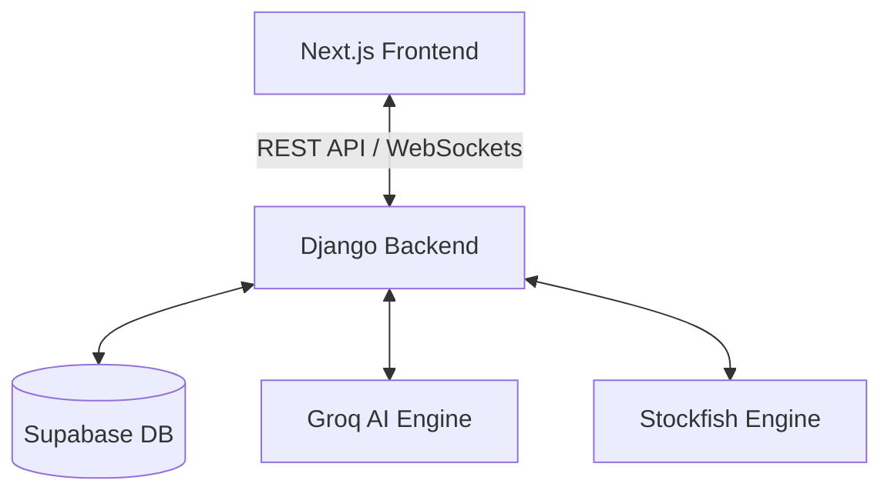

# ♟️ ChessMastery — Ultimate AI-Powered Chess Platform

[](https://link-to-your-video.com) 
*(Click the badge above to watch the platform in action)*

ChessMastery is a state-of-the-art chess ecosystem designed for players of all levels. It combines traditional chess mechanics with cutting-edge AI analysis, real-time multiplayer, and community features.

---

## 🏗️ System Architecture
Detailed technical breakdown can be found here: [Full Architecture Guide](./architecture.md)



---

## 🌟 Key Features
- **🤖 AI Analyzer**: Real-time position evaluation and move suggestions powered by Llama-3-70b via Groq.
- **⚔️ CS:GO Mode**: A unique variant with custom CT/T pieces and immersive sound effects.
- **🌍 Global Multiplayer**: Real-time PvP matches using WebSockets (Django Channels).
- **🎓 Interactive Lessons**: Learn tactics and openings with a step-by-step interactive board.
- **🛡️ Community Clubs**: Create or join clubs, participate in internal life and tournaments.
- **📈 Professional Rating**: Elo-based matchmaking and progress tracking.

---

## 🛠️ Design and Development Process

### Development:
- **Backend**: 
    - Designed robust **Django models** for users, club systems, and lesson tracking.
    - Implemented **DRF Serializers** for efficient data exchange and JWT-based authentication.
    - Developed **Async Consumers** for handle real-time game state synchronization.
- **Frontend**: 
    - Built with **React 19** using a modular component architecture.
    - Implemented **AuthContext** for global session management.
    - Crafted a premium UI using **Framer Motion** and **TailwindCSS**.
- **Integration**: 
    - Connected frontend and backend through a centralized API service layer with proper error handling and automatic trailing-slash protection.

---

## 🧪 Why This Tech Stack?
- **React**: Chosen for its component-based architecture, which enables efficient UI development and high-performance state management via hooks and context.
- **Django Rest Framework**: Selected for its robustness, built-in security features, and powerful serialization capabilities that streamline the development of complex APIs.
- **Supabase (PostgreSQL)**: Reliable cloud-native database that scales seamlessly.
- **Railway/Vercel**: Optimized for automated CI/CD and high availability.

---

## ⚠️ Known Issues & Roadmap
We are constantly improving the platform. Here are the current limitations:
- `[ ]` **Search**: Search functionality for players and clubs is not yet implemented.
- `[ ]` **Subscriptions**: Subscription system for following other users is not implemented.
- `[ ]` **Notifications**: Real-time notifications feature is currently in development.
- `[ ]` **Comments**: There is a known bug/missing logic with comment rendering in clubs.
- `[ ]` **Auth UI**: Minor styles bug on the Auth page (alignment on small screens).

---

## 🚀 Quick Start (Local Dev)

### Backend
```bash
cd backend
python -m venv venv
source venv/bin/activate # or venv\Scripts\activate
pip install -r requirements.txt
python manage.py runserver
```

### Frontend
```bash
cd frontend
npm install
npm run dev
```

---

*Designed with ❤️ for the Chess Community.*
