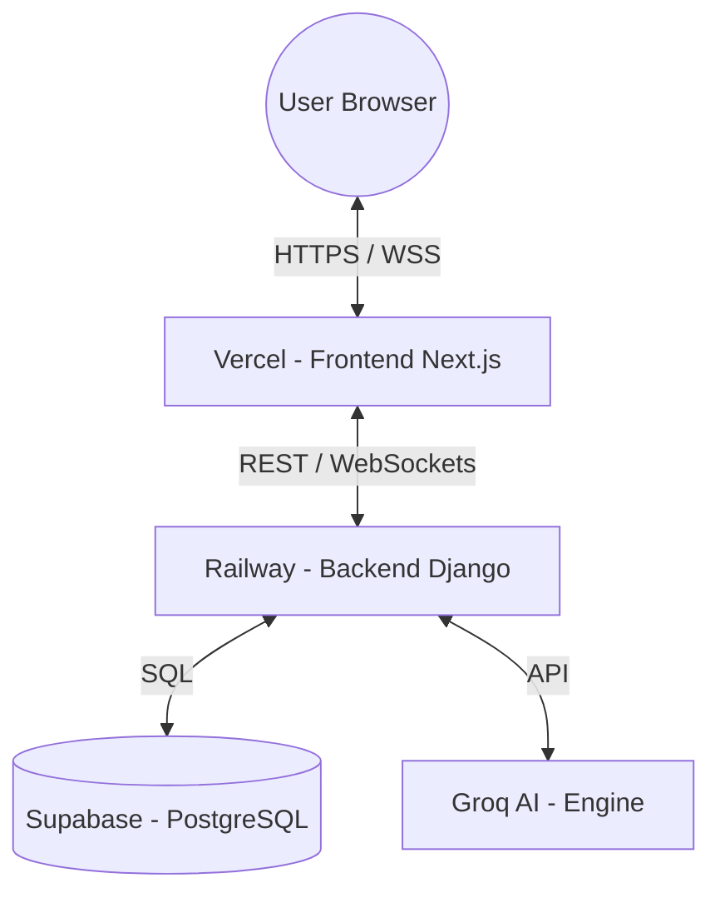
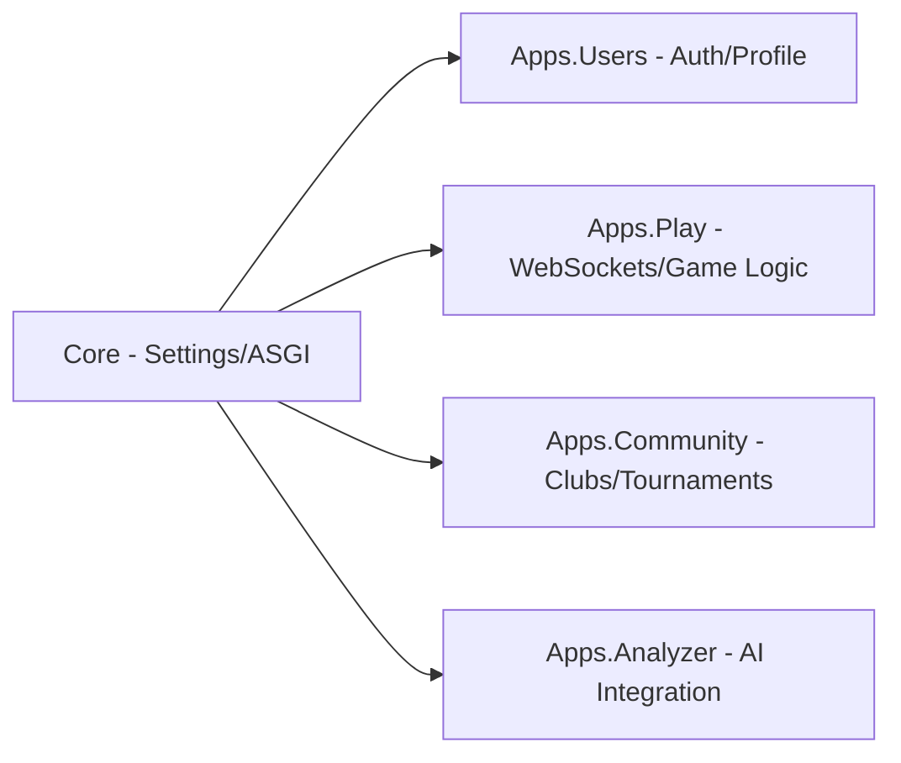
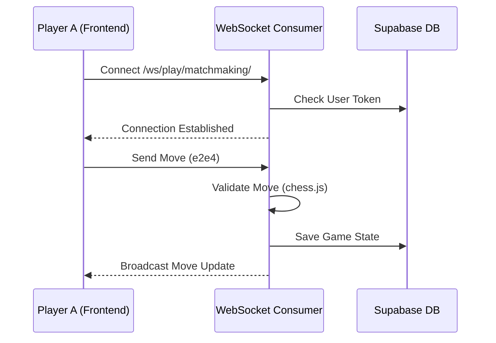

# ChessMastery Architecture Guide

This document provides a visual and structural overview of the ChessMastery platform.

## 1. System Overview
The platform follows a classic decoupled architecture with a Next.js frontend, a Django (DRF) backend, and a PostgreSQL database.

---

## 2. Backend Structure (Django Apps)
We follow a modular approach where each domain is isolated into its own application.

### Layered Architecture per App:
- **Models**: Database schema (Supabase).
- **Serializers**: Data transformation for JSON.
- **Views/Consumers**: Logic for REST and WebSockets.
- **Services**: Heavy business logic (e.g., Stockfish integration, Move validation).

---

## 3. Real-time Communication Flow (Game Play)
Real-time games use WebSockets via **Django Channels** and **Daphne**.

---

## 4. Technology Stack
- **Frontend**: Next.js 15, TailwindCSS, Framer Motion, Lucide React.
- **Backend**: Django 5.1, Django Channels (WebSockets), DRF (REST).
- **Database**: PostgreSQL (via Supabase).
- **AI**: Groq (Llama-3-70b) for analysis.
- **Deployment**: Vercel (Frontend), Railway (Backend).
